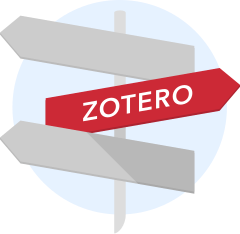

<!-- $theme: default-->
<!-- $size: 16:9 -->

# Présentation et actualité de Zotero

 

## Zotero & Omeka - des outils pour les humanités numériques
Espace Mendès France, Poitiers, 2019-01-16

<small>

*Frédérique Flamerie* 
*membre de la rédaction du blog [Zotero francophone](https://zotero.hypotheses.org/)*
*université de Bordeaux - Direction de la documentation*

</small>

---

# Zotero en quelques mots

[Pourquoi Zotero?](https://zotero.hypotheses.org/1998) - traduction de la page "Why Zotero?" publiée sur le site Zotero

Un logiciel de gestion bibliographique
Et plus encore : _**your personal research assistant**_

---

# [A propos](https://zotero.hypotheses.org/a-propos) du blog Zotero francophone : qui et pourquoi?

L'équipe de rédaction rassemble des contributeurs d’horizons divers, et souhaite ainsi croiser les perspectives et les usages, entre chercheurs et praticiens, entre les sciences humaines et sociales et les sciences, techniques et médecine.

---

# [A propos](https://zotero.hypotheses.org/a-propos) du blog Zotero francophone : qui et pourquoi?

## Suivre l'actualité de Zotero au sens large
:gb: :fr: Traduire les billets parus sur le blog officiel

:bookmark: Relayer des trucs et astuces : [Un été avec Zotero](https://zotero.hypotheses.org/1840)

:wrench: Apporter des éclairages techniques sur le fonctionnement du logiciel : [Quand le convertisseur web ne convertit plus…](https://zotero.hypotheses.org/1578), [Zotero et les DOI](https://zotero.hypotheses.org/1721)

:card_index: Raconter des cas concrets d’utilisation : [Zotero et LaTeX](https://zotero.hypotheses.org/762), [Markdown et Zotero](https://zotero.hypotheses.org/2258)

---

# [A propos](https://zotero.hypotheses.org/a-propos) du blog Zotero francophone : les extensions 

Twitter : [@zfrancophone](https://twitter.com/zfrancophone)
GitHub : [zfrancophone](https://github.com/zfrancophone)
Groupe Zotero : [zfrancophone](https://www.zotero.org/groups/2233096/zfrancophone)

---

# [A propos](https://zotero.hypotheses.org/a-propos) du blog Zotero francophone : qui et pourquoi?
## Orienter les utilisateurs 

 :point_right: vers le forum et la documentation Zotero

---

# Projets et perspectives pour le blog : idées de billet pour 2019
:pencil: Premières modifications d'un style CSL : illustration par un cas concret et commenté d'adaptation d'un style existant

:construction: Bonnes pratiques de création d'un style CSL : recommandations pour créer un style "propre", réutilisable et facile à adopter par son public cible

:briefcase: Migrer de XXX (EndNote, Papers) vers Zotero

:paperclip: ZotFile

---

# Projets et perspectives pour le blog (et la communauté francophone?) : contribuer aux outils communs

Le blog ne vise pas à se substituer à la documentation Zotero, mais à l'illustrer de cas particuliers et à la promouvoir.

Nous nous efforçons ainsi de traduire toutes les pages de la branche `fr` du wiki citées dans les billets.

Dans la même perspective de promotion des outils Zotero, nous continuons à encourager le recours au forum (plutôt qu'aux commentaires de billet ou à Twitter) pour toutes les demandes : contribuer au forum, c'est contribuer à constituer une base de connaissances commune pour tous les utilisateurs de Zotero.

---

# Projets et perspectives pour la communauté francophone

:page_with_curl: Créer et documenter des styles CSL

:mega: Promouvoir Zotero auprès de ses collègues, au sein de son établissement : par le biais de formations mais aussi d'initiatives telles que le [Dr Zotero de l'EPFL](https://library.epfl.ch/training-2/training-resources-tools/dr-zotero/), ou la création d'une communauté de _Zotero champions_

:bulb: Quels sont vos projets, vos idées ?

---
# Merci de votre attention

:email: frederique.flamerie-de-lachapelle@u-bordeaux.fr
:telephone_receiver: 05.40.00.89.91

 

 [orcid.org/0000-0001-6014-0134](https://orcid.org/0000-0001-6014-0134)

